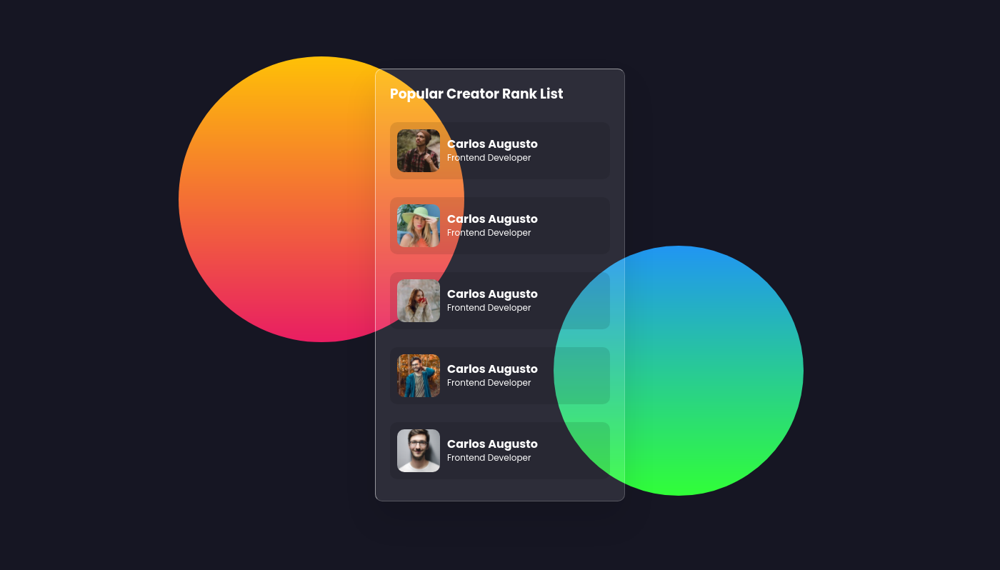

<p align="center">
    <a href="#-projeto">🖥 Projeto</a>&nbsp;&nbsp;&nbsp;|&nbsp;&nbsp;&nbsp;
    <a href="#-projeto">🎨 Layout</a>&nbsp;&nbsp;&nbsp;|&nbsp;&nbsp;&nbsp;
    <a href="#-tecnologias">👨‍💻 Tecnologias</a>&nbsp;&nbsp;&nbsp;|&nbsp;&nbsp;&nbsp;
    <a href="#-executar-o-projeto">🖇 Execução do Projeto</a>&nbsp;&nbsp;&nbsp;|&nbsp;&nbsp;&nbsp;
    <a href="#-licença">📃 Licença</a>&nbsp;&nbsp;&nbsp;|&nbsp;&nbsp;&nbsp;
    <a href="#-observações">📌 Observações</a>
</p>
<div style="display: flex; flex-direction: row; justify-content: center; align-items: center; flex-wrap: wrap"  align="center">
    
</div>


## 🖥 Projeto
O **Glassmorphism Card** é um projeto desenvolvido com base no vídeo do canal [Oline Tutorials](https://www.youtube.com/channel/UCbwXnUipZsLfUckBPsC7Jog). Feito para praticar algumas técnicas avançadas de css e animações nativas.
## 👨‍💻 Tecnologias
As tecnologias usadas nesse projeto foram:
- [HTML](https://developer.mozilla.org/en-US/docs/Web/HTML)
- [CSS](https://developer.mozilla.org/en-US/docs/Web/CSS)
- [SASS](https://sass-lang.com/)


## 🎨 Layout
Link para o vídeo do projeto: [Glassmorphism List Hover Effects | Html CSS](https://youtu.be/g_d9nczOvtY)


## 🖇 Executar o Projeto
Para executar o projeto, apenas é preciso clonar ele em seu dispositivo:

- Clone o repositório
    ```bash
    $ git clone https://github.com/Yta-ux/glassmorphism-card.git
    ```
 
##  📃 Licença
Esse projeto possui licença MIT. Para mais detalhes consulte o arquivo [LICENSE](LICENSE.md)


## 📌 Observações
- Projeto responsivo;
